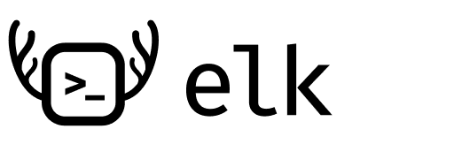
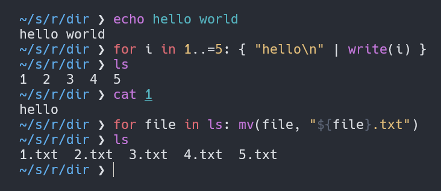

<br>

Elk is an experimental shell language that aims to seamlessly combine the syntax of a shell language like bash with the syntax of a general-purpose language like Python. Bash is great for executing programs and handling files, but can be quite limiting and tedious to use when it comes to dealing with different data types and performing complex operations.




[Read More / Documentation](https://elk.strct.net)

The fundamental syntax of Elk is similar to that of languages like Python, meaning you can easily define variables and functions and perform operations just like you would in regular scripting languages. At the same time, programs can be executed as easily as in bash, making it a good choice for shell scripting and command line usage. This is achieved by treating program invocations as function calls syntactically, while also allowing these to be written similar to program invocations in shell languages.

In Elk, redirection of standard output is done automatically, removing the need for command substitution (eg. `$(ls)`), arithmetic expansion (eg. `$((1+2))`), and process substitution (eg. `<(list)`). When a program invocation expression is in a context where its value is used, the standard output of the resulting process is redirected and handled by Elk, giving the illusion that program invocations are simply function calls.

```nim
# here, 'ls' and 'echo' are program invocations, while 'lines' is a 
# call to a built-in Elk function
#
# programs and functions can be called both using bash-like invocation
# syntax (arguments parsed as pure text) and Python-like parenthesised
# invocation syntax
let imageFiles = ls images/*.png | str::upper
echo(imageFiles[0])

# clean syntax
if len(imageFiles) > 1 {
    imageFiles | len | println
}

# the elk shell can even be used as a calculator
# since arithmetic operations can be done anywhere
5 + 3
```

## Installation

The installation steps are described [on the website](https://elk.strct.net/getting-started/installation.html).

## Language Features

* Variables of different data types without a prefix (like $)
* User-defined functions
* Convenient syntax for program invocation
* Pipes for both program and function calls
* Module system that supports circular imports
* Standard library with operations that are common in general-purpose languages such as string operations or date/time handling
* Control flow (if, for, while, etc.) with a clean familiar syntax
* Common operations (like arithmetic operations) that can be done anywhere, unlike in bash
* ...more

## UX Features

* Commands preceded by $: are evaluated as bash, making it easy to paste bash commands into the shell when necessary
* Custom completions
* Semantic highlighting (in the command line shell, Neovim and Visual Studio Code)
* Hints (history, file names)
* ...more
