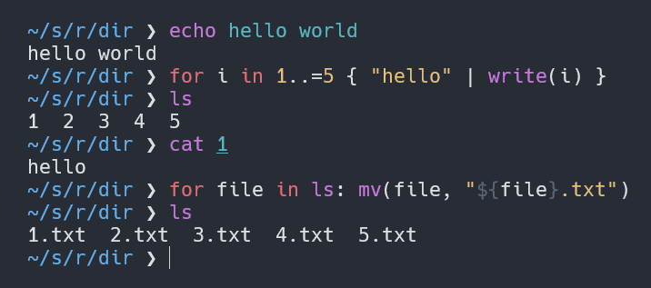

# Elk

## Installation

Installation steps:
* Install `.NET 6 SDK`
* Initialize the submodules `git submodule update --init --recursive`
* Go to the source directory `cd src`
* Compile the program `dotnet build -c Release`
* Run the program `./bin/Release/net6.0/Elk`
